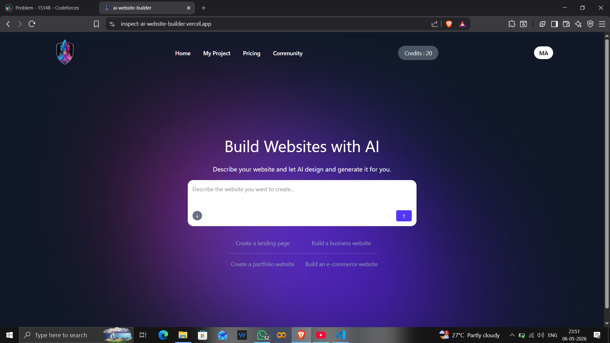
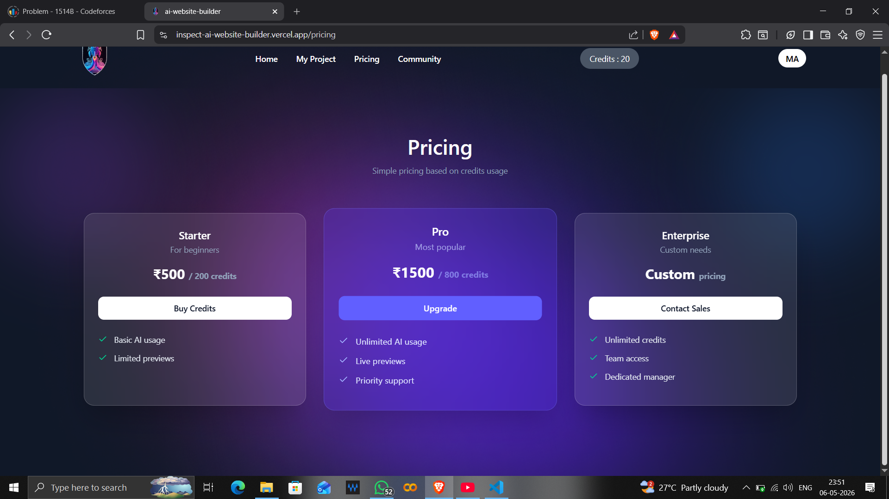

# Inspect-AI: AI-Powered Website Builder

Inspect-AI is an advanced, AI-powered platform designed to accelerate web development by generating dynamic site previews directly from user prompts. By leveraging high-performance backend architecture and intelligent AI integration, the platform enables seamless transitions from initial concept to live preview.

## Project Overview

### Home

*The landing experience provides users with an intuitive interface to input prompts and initiate the site generation pipeline.*

### Pricing

*Detailed breakdown of subscription tiers powered by Stripe for secure transaction management.*

### Process

*A visual representation of the automated pipeline that converts user requirements into a functional, live-preview website.*

## Key Features

* **AI-Driven Generation**: Accelerated site generation by 70% by architecting an automated pipeline using OpenRouter AI.
* **Optimized Performance**: Reduced API response times by 150ms through re-architecting PostgreSQL schemas and utilizing Prisma ORM.
* **Reliable Deployment**: Orchestrated GitHub Action CI/CD workflows to streamline release engineering and deployment stability.
* **Integrated Payments**: Secure payment processing utilizing Stripe integration.

## Technology Stack

* **Frontend**: React, TypeScript, Tailwind CSS
* **Backend**: Node.js, Express
* **Database**: Neon PostgreSQL, Prisma ORM
* **AI & Services**: OpenRouter AI, Stripe

